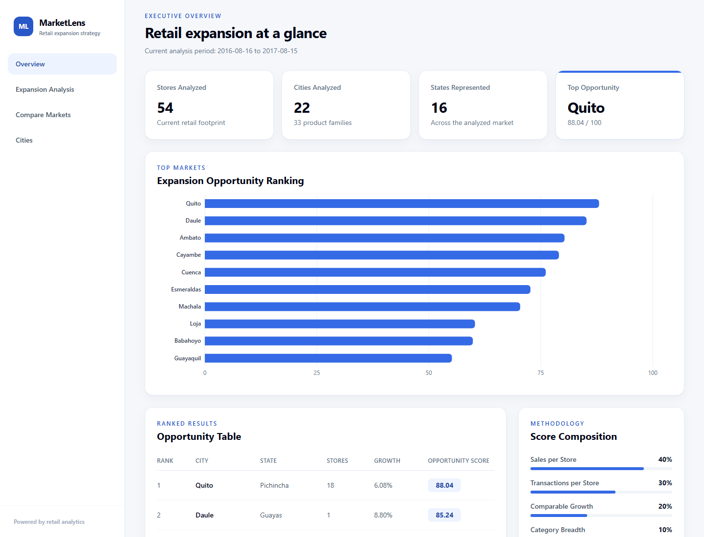
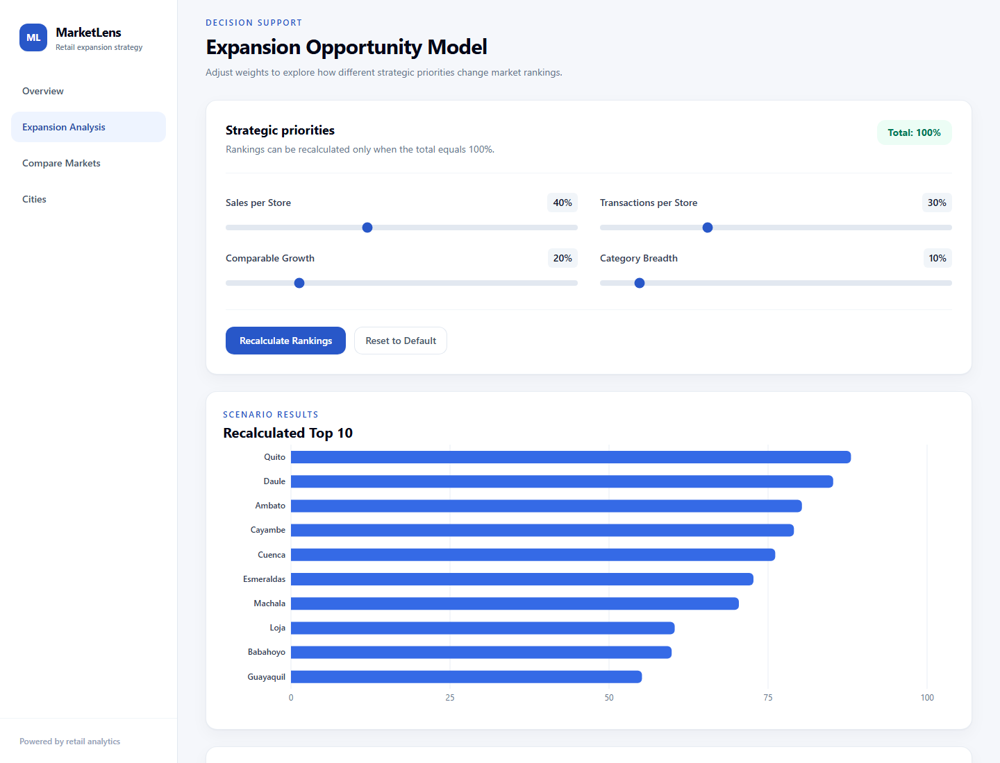
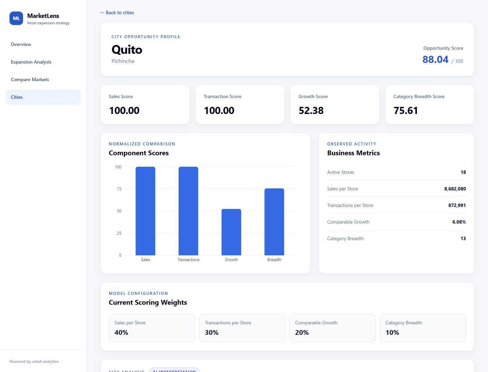
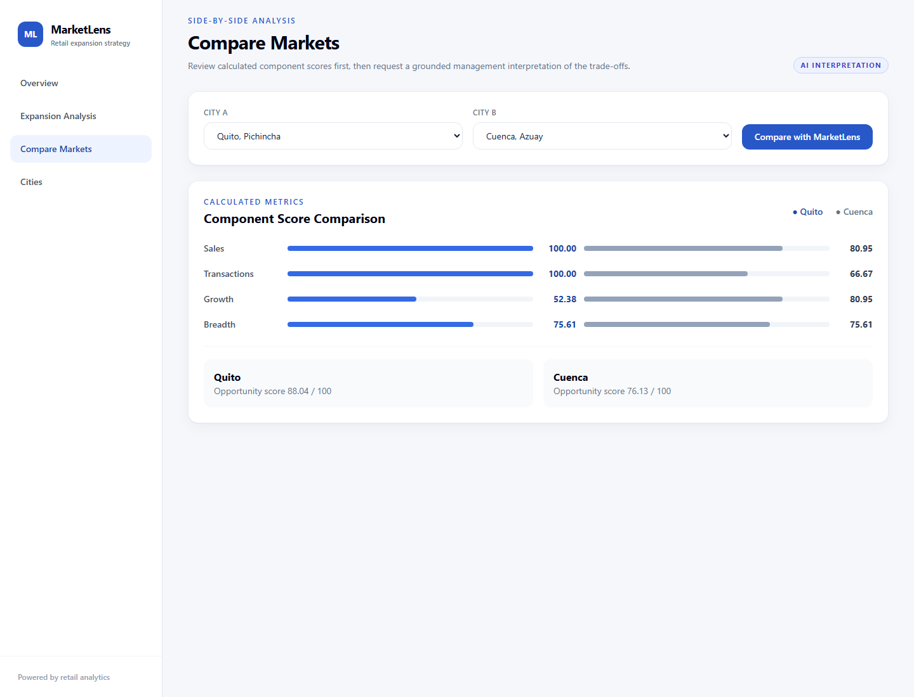

# MarketLens — Retail Expansion & Strategy Copilot

MarketLens is a GenAI-powered retail expansion decision-support platform that
combines deterministic business analytics with grounded natural-language
management insights.

## Problem

Retail expansion decisions depend on several demand, customer-activity, growth,
and diversification signals. MarketLens provides a transparent prototype for
prioritizing markets without pretending that one score can replace financial,
location, competitive, or operational due diligence.

## What MarketLens Does

- Analyzes historical retail sales activity and transactions.
- Calculates explainable city-level expansion indicators.
- Ranks 22 markets using configurable strategic weights.
- Visualizes rankings, raw metrics, and normalized component scores.
- Generates grounded executive insights through Gemini.
- Compares two markets using their trusted calculated metrics.
- Answers natural-language questions about the MarketLens analysis.

## Architecture

```text
Raw retail data
      ↓
Pandas analytics
      ↓
Validated city metrics
      ↓
FastAPI backend ─────→ Gemini strategy copilot
      ↓                       ↑
React dashboard ──────────────┘
```

Gemini receives its analytical context through FastAPI. The browser never calls
Gemini directly and never receives the API key or internal system prompt.

## Expansion Opportunity Score

The default score combines four 0–100 percentile components:

- **40% Sales per Store**
- **30% Transactions per Store**
- **20% Comparable-Store Sales Growth**
- **10% Category Breadth**

The weights are configurable strategic assumptions, not universal truths. Raw
metrics are normalized before weighting so incompatible units are not added
directly.

## GenAI Design

**Gemini does not calculate the MarketLens opportunity score. All numerical
analytics are performed deterministically in Python. Gemini is used only for
interpretation, comparison, and natural-language synthesis.**

Grounding is implemented by selecting trusted processed metrics in FastAPI,
supplying explicit methodology and limitations, constraining Gemini with a shared
system prompt, requesting schema-controlled JSON, and validating responses with
Pydantic. If the evidence is insufficient, the copilot must say that MarketLens
cannot answer from its current data.

## Dataset

MarketLens uses Kaggle's
[Store Sales — Time Series Forecasting competition](https://www.kaggle.com/competitions/store-sales-time-series-forecasting),
created by Alexis Cook, DanB, inversion, and Ryan Holbrook (2021), specifically
`train.csv`, `stores.csv`, and `transactions.csv`.

Kaggle labels the license **Subject to Competition Rules**. Raw Kaggle CSV files
and downloaded ZIP archives are therefore never committed or redistributed. The
repository retains only a small, non-row-level 22-city analytical output and its
validation metadata so the dashboard can run without republishing the source
dataset. Anyone rerunning the pipeline must obtain the inputs from Kaggle under
Kaggle's terms.

- `sales` represents sales activity or quantity, not revenue.
- Profitability and price data are unavailable.
- Population and demographic data are unavailable.
- Competitor information is unavailable.
- Real-estate and logistics costs are unavailable.
- Market-size information is unavailable.

The application therefore supports investigation prioritization rather than
final store-opening decisions.

## Tech Stack

- **Frontend:** React, Vite, Tailwind CSS, Recharts
- **Backend:** Python, FastAPI, Pydantic
- **Analytics:** Pandas, NumPy
- **GenAI:** Google Gemini API through `google-genai`
- **Testing:** Python `unittest`, FastAPI `TestClient`, production Vite builds

## Features

- Executive analytics dashboard
- City expansion-opportunity ranking
- Configurable scoring weights and scenario re-ranking
- Searchable and filterable city comparison table
- City scorecards with component charts
- Numeric side-by-side market comparison
- Grounded executive AI insights
- Grounded Ask MarketLens questions
- Graceful AI and API failure handling

## Screenshots

### Executive overview



### Expansion analysis



### City detail



### Market comparison



These are real captures from the locally running application using its processed
analytics. An Executive Copilot screenshot is intentionally omitted until a real
Gemini smoke test passes.

## Running Locally

Prepare and start the backend:

```powershell
git clone https://github.com/AshmitThakur/MarketLens.git
cd MarketLens
python -m venv .venv
.venv\Scripts\Activate.ps1
pip install -r requirements.txt
Copy-Item .env.example .env
# Add GEMINI_API_KEY to .env for the optional copilot features.
uvicorn backend.api.main:app --reload
```

Start the frontend in a second terminal:

```powershell
cd frontend
npm.cmd install
npm.cmd run dev
```

Open the dashboard at `http://127.0.0.1:5173` and Swagger at
`http://127.0.0.1:8000/docs`. The deterministic dashboard works without a Gemini
key; only AI actions require it.

## Testing

```powershell
.venv\Scripts\python.exe -B -m unittest discover -s tests -v

cd frontend
npm.cmd run build
npm.cmd audit --omit=dev
```

The current release passes **37 backend, analytics, API, and mocked-AI tests**.
The frontend production build passes, and the production dependency audit reports
no known vulnerabilities. Automated tests never make real Gemini calls, so live
Gemini connectivity remains pending until a real key-backed smoke test passes.

## Deployment configuration

The minimal deployment is React on Vercel and FastAPI on Render.

### Render backend

- Root directory: repository root (leave the Render field blank)
- Runtime: Python
- Build command: `pip install -r requirements.txt`
- Start command: `uvicorn backend.api.main:app --host 0.0.0.0 --port $PORT`
- Health check path: `/api/health`
- Required environment variable: `FRONTEND_URL=https://<your-vercel-domain>`
- Optional additional origins: `CORS_ORIGINS=https://<preview-domain>,https://<other-domain>`
- Optional AI variables: `GEMINI_API_KEY`, `GEMINI_MODEL`, and
  `GEMINI_TIMEOUT_SECONDS`

### Vercel frontend

- Root directory: `frontend`
- Framework preset: Vite
- Build command: `npm run build`
- Output directory: `dist`
- Required environment variable:
  `VITE_API_BASE_URL=https://<your-render-service>`

Deploy Render first, then supply its URL to Vercel. After Vercel assigns the final
domain, set that exact origin in Render's `FRONTEND_URL` and redeploy the backend.
`frontend/vercel.json` provides the SPA route fallback. Keep `GEMINI_API_KEY` in
Render only; never expose it through a `VITE_` variable.

## Limitations & Future Work

Current limitations include the absence of profitability, price, cost,
demographic, competition, logistics, real-estate, and market-size data. Historical
performance at an existing store may not transfer to a new location, and GenAI
interpretations still require human review.

Possible future improvements—not current functionality—include:

- Incorporating profitability, operating-cost, and site-level financial data.
- Adding demographic, competition, real-estate, and logistics data.
- Supporting user-uploaded datasets that satisfy a documented input contract.
- Adding time-series forecasting after the descriptive foundation is validated.
- Adding RAG over market reports and internal strategy documents when the textual
  knowledge base becomes large enough to justify retrieval infrastructure.

## Methodology in interview-friendly language

### 1. Business question

The score answers: **Which cities show the strongest evidence, in historical
store activity, for deeper expansion analysis?** It creates a shortlist; it does
not decide where a store should open.

### 2. Why these four metrics?

- **Sales per store (40%)** measures sales activity in the current 365-day
  period without automatically rewarding cities simply because they already
  contain more stores.
- **Transactions per store (30%)** adds a current-period customer-visit signal.
  It complements unit sales because many units could be sold in relatively few
  transactions.
- **Comparable-store sales growth (20%)** shows recent direction while avoiding
  growth created only by adding stores.
- **Category breadth (10%)** rewards cities where current-period demand spans
  several meaningful product families, a simple signal of diversified demand.

The breadth rule remains the requested one: a family counts when it contributes
at least 1% of a city's unit sales during the current 365-day period. It is
transparent and easy to defend, so there is no need to replace it in V1.

All activity metrics (`total_sales`, `sales_per_store`, `total_transactions`,
`transactions_per_store`, and `category_breadth`) use the current 365-day period.
For this dataset that is **2016-08-16 through 2017-08-15**, inclusive. This makes
the ranking reflect current expansion opportunity rather than cumulative history.

### 3. Why percentile normalization?

The raw metrics have incompatible units and ranges: unit sales, transactions,
percent growth, and family counts. Adding them directly would let the largest
numeric scale dominate. Each metric is therefore ranked across cities and mapped
to 0–100. The lowest observed value receives 0, the highest 100, ties receive
their average rank, and an all-tied metric receives a neutral 50.

Percentiles describe relative position in this dataset. They do not mean that a
city is objectively “90% good.”

### 4. How comparable-store growth works

The maximum sales date anchors two adjacent 365-day windows:

1. Current: the most recent date and preceding 364 days.
2. Previous: the 365 days immediately before the current window.
3. A store qualifies only if its total unit sales are greater than zero in both
   windows. This is the observable V1 definition of an active store.
4. For each city, current and previous sales are summed only across qualifying
   stores, then growth is `(current / previous - 1) × 100`.

Aggregating comparable-store sales before calculating growth gives appropriately
more influence to stores with more activity and avoids averaging unstable rates
from tiny stores.

### 5. Why exclude new stores from growth?

A new store has current-period sales but no true previous-period baseline. If its
sales were included, opening locations would look like organic growth in existing
operations. The comparable-store rule separates expansion of the store footprint
from growth at stores that operated in both periods.

### 6. Why weighted scoring?

A weighted score makes the business priorities explicit and produces a usable
ranking while retaining each component for auditability. The defaults emphasize
established activity (70%), then direction (20%) and diversification (10%). All
four weights are parameters, must be non-negative, and must sum to 1.0.

### 7. Limitations

- Unit sales do not measure revenue, profitability, basket value, or costs.
- Historical performance at existing stores may not transfer to a new location.
- The data has no population, demographics, real estate, competitors, logistics,
  local market size, or store-capacity information.
- A single recent year can be affected by temporary shocks or unusual promotions.
- Transactions are available at store-day level, not by product family.
- Percentile results depend on the cities present and compress absolute gaps.
- The 1% category threshold is simple but business-defined and may need sensitivity
  testing later.
- Promotions, holidays, store types, clusters, and seasonality are not controlled
  for in this deliberately small V1.

For those reasons, the result is **decision support**: it prioritizes cities for
research. A real opening recommendation requires financial, customer, location,
competitive, operational, and risk analysis.

## Project structure

```text
marketlens/
├── backend/
│   ├── __init__.py
│   ├── analytics/
│       ├── __init__.py
│       ├── loader.py
│       ├── metrics.py
│       ├── scoring.py
│       └── pipeline.py
│   ├── ai/
│   │   ├── gemini_service.py
│   │   ├── prompts.py
│   │   └── models.py
│   ├── api/
│   │   ├── main.py
│   │   ├── models.py
│   │   ├── dependencies.py
│   │   └── routes/
│   │       ├── ai.py
│   │       ├── overview.py
│   │       ├── cities.py
│   │       └── scoring.py
│   └── services/
│       └── data_service.py
├── data/
│   ├── raw/               # place the three Kaggle CSVs here
│   └── processed/         # city metrics and metadata are generated here
├── frontend/
│   ├── src/
│   │   ├── api/
│   │   ├── components/
│   │   ├── pages/
│   │   ├── App.jsx
│   │   └── main.jsx
│   ├── package.json
│   └── vite.config.js
├── tests/
│   ├── test_analytics.py
│   └── test_api.py
├── .gitignore
├── README.md
└── requirements.txt
```

## Run the pipeline

From this `marketlens` directory:

```powershell
python -m venv .venv
.venv\Scripts\Activate.ps1
pip install -r requirements.txt
```

Place `train.csv`, `stores.csv`, and `transactions.csv` in `data/raw`, then run:

```powershell
python -m backend.analytics.pipeline
```

The command prints coverage checks, missing-value counts, the exact growth
windows, comparable-store count, and top 10 rows. It writes the complete ranking
to `data/processed/city_metrics.csv`.

Optional weights can be supplied without changing code:

```powershell
python -m backend.analytics.pipeline `
  --sales-weight 0.35 `
  --transaction-weight 0.35 `
  --growth-weight 0.20 `
  --breadth-weight 0.10
```

Run the full test suite with:

```powershell
python -m unittest discover -s tests -v
```

## Phase 2 API

Start the development server from the project directory:

```powershell
.venv\Scripts\Activate.ps1
uvicorn backend.api.main:app --reload
```

The API is available at `http://127.0.0.1:8000`, with interactive Swagger
documentation at `http://127.0.0.1:8000/docs` and the OpenAPI document at
`http://127.0.0.1:8000/openapi.json`.

### Endpoints

- `GET /api/health` checks that the service is reachable.
- `GET /api/overview` returns executive totals, the leading city, and analysis dates.
- `GET /api/cities?limit=10&state=Pichincha` returns ranked city metrics with
  optional limiting and case-insensitive state filtering.
- `GET /api/cities/{city}` returns one case-insensitive city match plus the default
  weight configuration; an unknown city returns HTTP 404.
- `POST /api/score` validates custom weights and re-ranks the cached percentile
  scores without rerunning the raw analytics.
- `GET /api/states` returns city count, store count, and average opportunity score
  for each state.

Example health response:

```json
{"status": "ok", "service": "MarketLens API"}
```

Example overview response:

```json
{
  "total_stores": 54,
  "cities_analyzed": 22,
  "states": 16,
  "product_families": 33,
  "top_opportunity": {
    "city": "Quito",
    "state": "Pichincha",
    "score": 88.037166
  },
  "analysis_period": {"start": "2016-08-16", "end": "2017-08-15"}
}
```

Example custom-scoring request:

```json
{
  "sales_weight": 0.40,
  "transaction_weight": 0.30,
  "growth_weight": 0.20,
  "breadth_weight": 0.10
}
```

### Why this API design is interview-friendly

1. **Why FastAPI?** It provides type-driven request validation, automatic OpenAPI
   documentation, strong performance, and little setup code for a Python analytics
   project.
2. **Why is the processed CSV enough for V1?** The API serves completed city-level
   metrics, so it does not need a database or the three-million-row raw dataset for
   each dashboard request. The small generated metadata JSON supplies audit totals
   and analysis dates.
3. **Why does custom scoring not rerun analytics?** The four percentile component
   scores are already present in `city_metrics.csv`. Changing priorities requires
   only four multiplications per city followed by sorting.
4. **What does Pydantic do?** It validates incoming weights, documents request and
   response shapes, and ensures the API returns predictable types.
5. **What is the data flow?** The future React client sends an HTTP request to
   FastAPI; a route asks the cached data service for processed analytics; Pydantic
   validates the response; FastAPI returns JSON.
6. **Why separate API and analytics?** Analytics owns business calculations, while
   the API owns HTTP concerns. Either side can change or be tested without mixing
   routing code into the scoring logic.

### Important Phase 2 files

- `backend/api/main.py` creates the app, configures CORS, registers routes, and
  loads processed data during startup.
- `backend/api/models.py` defines the validated API contracts.
- `backend/api/dependencies.py` supplies the single cached data service.
- `backend/api/routes/` keeps overview, city, and scoring handlers small.
- `backend/services/data_service.py` validates and caches processed data, filters
  cities, aggregates states, and performs fast custom re-ranking.
- `tests/test_api.py` exercises successful responses, filtering, 404 handling, and
  invalid input.

The V1 cache is per application process. City names are unique in the current
dataset, and state matching is case-insensitive. CORS always includes the common
local React origins on ports 3000 and 5173, adds the production `FRONTEND_URL`,
and accepts optional extra origins through comma-separated `CORS_ORIGINS`.

## Generative AI Architecture

```text
Raw retail data
       ↓
Python/Pandas deterministic analytics
       ↓
Validated 22-city metrics
       ↓
FastAPI trusted context builder
       ↓
Gemini structured interpretation
       ↓
React management presentation
```

**Gemini does not calculate the MarketLens opportunity score. All numerical
analytics are performed deterministically in Python.** Gemini explains the
validated metrics, compares trade-offs, and translates them into concise
management language.

### AI endpoints

- `POST /api/ai/insights` sends the top five cities with city/state, opportunity
  score, four component scores, active stores, current weights, methodology, and
  limitations.
- `POST /api/ai/compare` validates two city names and sends exactly their existing
  city-metric records plus weights, methodology, and limitations.
- `POST /api/ai/ask` sends the small processed set of 22 city records plus weights,
  methodology, and limitations. It never sends the raw three-million-row dataset.

The shared system prompt requires every numerical fact to come from supplied
context, prohibits external claims and causal conclusions, and frames rankings as
decision support. Unsupported questions must receive an explicit limitation.
Referenced city names are also filtered against the trusted processed dataset.

Gemini uses Pydantic response schemas so each feature receives predictable JSON.
The backend validates that JSON before React sees it. Structured output improves
reliability but does not guarantee that every interpretation is perfect, so the UI
labels AI commentary separately from calculated metrics.

The API key stays in FastAPI because exposing it through Vite would make it visible
in the browser bundle. Copy `.env.example` to `.env` and set:

```dotenv
GEMINI_API_KEY=your_real_key
GEMINI_MODEL=gemini-3.8-flash
GEMINI_TIMEOUT_SECONDS=30
```

If the key is absent, AI endpoints return HTTP 503. Upstream or malformed-response
failures return a clean HTTP 502. All analytics and non-AI dashboard routes remain
available.

Transient Gemini HTTP 429 and 503 responses receive at most two retries after the
initial request. The retry delay uses exponential backoff, small random jitter,
and any provider `Retry-After` value, while all attempts share the configured
`GEMINI_TIMEOUT_SECONDS` deadline. Permanent provider errors and structured-output
validation failures are not retried.

### Example grounded comparison

For Quito versus Cuenca, the supplied data shows Quito at 88.04 overall with sales
and transaction scores of 100.00, while Cuenca is 76.13 overall with a stronger
growth score of 80.95 versus Quito's 52.38. A valid interpretation is that the
default 40% sales and 30% transaction weights favor Quito's activity leadership,
while Cuenca's stronger recent growth remains an important trade-off. It would not
be valid to infer profitability, population, or competitive conditions.

### Why no RAG or vector database?

All 22 structured city records fit comfortably in one request, so retrieval
infrastructure would add complexity without improving grounding. RAG could become
useful if MarketLens later includes annual reports, market-research PDFs,
competitor documents, internal strategy documents, or thousands of textual
records.

### Phase 4 interview explanation

1. GenAI is useful for explanation and synthesis; Python already handles the
   auditable numerical work.
2. Keeping calculations in Python prevents probabilistic model output from
   changing trusted scores.
3. Grounding means Gemini receives only selected MarketLens facts and must answer
   from them.
4. Hallucination risk is reduced through narrow context, a restrictive system
   prompt, structured schemas, validation, and explicit limitations.
5. FastAPI calls Gemini so the key and internal prompts never enter the browser.
6. Structured JSON gives React stable fields instead of unpredictable prose.
7. If Gemini is unavailable, only the optional AI panel fails; analytics continue.
8. Ask MarketLens receives the processed records for all 22 cities from the data
   service.
9. RAG is unnecessary for a tiny structured dataset.
10. RAG becomes useful when the product must search a large textual knowledge base.

## Phase 3 frontend

The React dashboard lives in `frontend/` and contains five routed views:

- `/` — executive overview with KPI cards, top-10 chart, ranking table, and score
  composition.
- `/analysis` — adjustable scoring weights with guarded recalculation and reset.
- `/compare` — numeric side-by-side city scores with an optional AI interpretation.
- `/cities` — searchable, state-filtered, sortable city comparison table.
- `/cities/:city` — city scorecard, raw metrics, component chart, and active weights.

The frontend is structured around a small API client in
`frontend/src/api/marketlens.js`, reusable dashboard components, and one component
per routed page. `VITE_API_BASE_URL` selects the backend without embedding a
deployment URL in the source. It defaults to `http://127.0.0.1:8000`.

Install and run the frontend:

```powershell
cd frontend
npm.cmd install
npm.cmd run dev
```

In a second terminal, run the backend:

```powershell
cd MarketLens
.venv\Scripts\Activate.ps1
uvicorn backend.api.main:app --reload
```

Open `http://127.0.0.1:5173`. To use another API location, copy `.env.example` to
`.env` and change `VITE_API_BASE_URL`. Validate the production bundle with:

```powershell
npm.cmd run build
```

React handles navigation and user interactions, but it does not reproduce the
business analytics. Every metric comes from FastAPI. A custom weighting scenario
flows from the four controls to `POST /api/score`, and the returned ranking is
shown without overwriting the default dataset. Recharts provides responsive,
declarative business charts without requiring low-level SVG code.

## Important functions

- `load_data`: checks that all files/columns exist, parses dates, rejects invalid
  core values, validates store keys, and warns about missing store-level and
  positive-sales-day transaction coverage.
- `calculate_activity_metrics`: filters sales and observed transactions to the
  current 365-day period, totals them by city, and divides each by the number of
  current-period stores with sales records.
- `calculate_comparable_growth`: creates the two date windows, identifies stores
  with positive sales in both, and calculates aggregated city growth.
- `calculate_category_breadth`: calculates each family's current-period city
  sales share and counts families meeting the 1% threshold.
- `percentile_score`: maps a raw metric onto a comparable 0–100 rank.
- `score_city_metrics`: applies validated configurable weights. A missing component
  deliberately leaves the composite missing rather than silently reweighting it.
- `run_pipeline`: coordinates the steps, writes the output, and returns an
  audit-friendly validation summary.

## Assumptions

- “Active store” in the general city metrics means a store appearing in the
  current 365-day slice of `train.csv`; for comparable growth it specifically
  means positive total sales in each of the two periods.
- The latest date in `train.csv` anchors the growth windows.
- If the dataset does not span both complete 365-day windows, comparable growth
  is left missing for every city rather than presenting partial history as annual
  growth.
- Sales, transactions, and category breadth use only the current 365-day period.
- Missing transaction records are **not treated as zero**. Transaction totals and
  per-store metrics use only observed transaction records, and coverage gaps are
  surfaced in the validation output.
- A city without enough comparable history receives missing growth and composite
  scores and sorts after fully scored cities.
- City plus state is the location key, preventing same-named cities in different
  states from being combined.

## Data status

The three Kaggle inputs may be placed locally in `data/raw`, and the latest run
generated the real 22-city ranking in `data/processed/city_metrics.csv`. Raw CSVs
remain gitignored. The small city aggregate and metadata are intentionally kept
so the dashboard and API can run without redistributing Kaggle source records.
